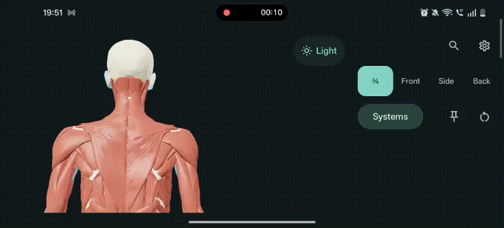

# AnatomyGo

**Explore the body. Understand the connections. Keep your curiosity moving.**

AnatomyGo is building an interactive 3D biology learning ecosystem, starting with human anatomy. We want students, educators, and curious minds to explore complex structures at their own pace—through tools that feel natural to use and are easy to access.

**[Explore anatomygo.in](https://anatomygo.in)** · **[Share feedback](https://github.com/th3kumar/anatomygo-site/issues)**

## Start with curiosity

A diagram can name a structure. Exploring it in 3D helps you see where it sits, what surrounds it, and how the pieces fit together.

Our longer-term vision connects interactive models, personal study tools, and shared learning across biology. Human anatomy is our starting point. Broader biology experiences are a direction we hope to grow into, not features we already offer.

One principle guides that growth: **learning should stay simple, even as the tools become more capable.** New features should earn their place without crowding the view or interrupting exploration.

## Explore on the web today

Visit **[anatomygo.in](https://anatomygo.in)** to start exploring in your browser, without an account or an app installation.

- Rotate, zoom, and select anatomy directly in 3D.
- Explore **15 anatomical systems**, **2,234 individual meshes**, and **3,432 named anatomical concepts**.
- Search for a structure, isolate it, or spread visible pieces apart for a clearer look.
- Choose light or dark appearance and move the light to examine surface detail.
- Open views shared from AnatomyGo, read shared study pins, and reveal answers in quiz mode. The web page can open the selected structure in the 3D explorer; shared pins are currently listed separately from that 3D view.

The current model is BodyParts3D's adult male reference anatomy. Coverage varies by structure; it does not represent every anatomical feature or human variation. Individual meshes and anatomical concepts are different: one concept can group several pieces.

## Android is coming soon

Our native Android app is in development and testing, with a public launch planned. It brings the same emphasis on direct, comfortable exploration to your phone, with offline anatomy after the initial model download, personal study pins, and tools for sharing what you are learning.

### A look at the app in progress



*Development recording from September 21, 2026. The interface continues to evolve; this is a preview, not a public release announcement.*

While Android prepares for launch, the website is available on phones, tablets, and computers—including iPhones.

## Built on shared work

AnatomyGo builds on [Human Atlas](https://github.com/ashemag/human-atlas), an MIT-licensed React and Three.js anatomy explorer, and the [BodyParts3D](https://dbarchive.biosciencedbc.jp/en/bodyparts3d/) anatomy dataset from the Database Center for Life Science.

We credit those foundations openly. AnatomyGo's website work includes a mobile-app sharing flow and landing page, shared-pin answer reveal, movable lighting, light/dark appearance, and interaction fixes adapted from upstream work. The native Android app is developed separately.

### Repository and source status

This repository contains the **deployed static website** served by GitHub Pages: HTML, compiled JavaScript/CSS, model files, and the shared-view page. It does not currently include the editable source for AnatomyGo's customised web application. The linked Human Atlas repository provides the upstream source, but does not contain all AnatomyGo-specific changes.

The Android application's source is not currently public. Its preview here demonstrates development progress; it is not an open-source Android release.

- **Upstream application:** [MIT license notice](human-atlas-license.txt).
- **Anatomy data:** CC BY 4.0, with sources and adaptation details in [ATTRIBUTION.md](ATTRIBUTION.md).
- **Third-party dependencies:** retain their respective licenses.

## Help shape AnatomyGo

The project is maintained by [@th3kumar](https://github.com/th3kumar). Feedback and proposals are welcome through [GitHub Issues](https://github.com/th3kumar/anatomygo-site/issues); the maintainer reviews changes and coordinates releases.

You can help by:

- Trying the viewer and describing anything that feels confusing or difficult.
- Reporting bugs with your device/browser, steps to reproduce, and expected behaviour.
- Identifying anatomical naming or coverage problems, with a reference where possible.
- Suggesting improvements to accessibility, learning workflows, or documentation.
- Submitting documentation corrections through a pull request.

Please discuss larger changes in an issue first. Since the website assets are compiled, avoid editing the generated bundles directly. Keep discussion respectful and focused on helping people learn.

## Preview this website locally

This is a static deployment, so no Node.js build step is required to serve the files already in this repository. With Python 3 installed:

```sh
git clone https://github.com/th3kumar/anatomygo-site.git
cd anatomygo-site
python3 -m http.server 8080 --bind 127.0.0.1
```

Open **http://127.0.0.1:8080**. The viewer needs a browser with WebGL support. These commands preview the deployed build; they do not rebuild the application from source.

When updating the deployment, preserve `CNAME`, `.nojekyll`, `.well-known/assetlinks.json`, `/v/`, and the attribution files. Existing shared links depend on the domain and shared-view route remaining available.
